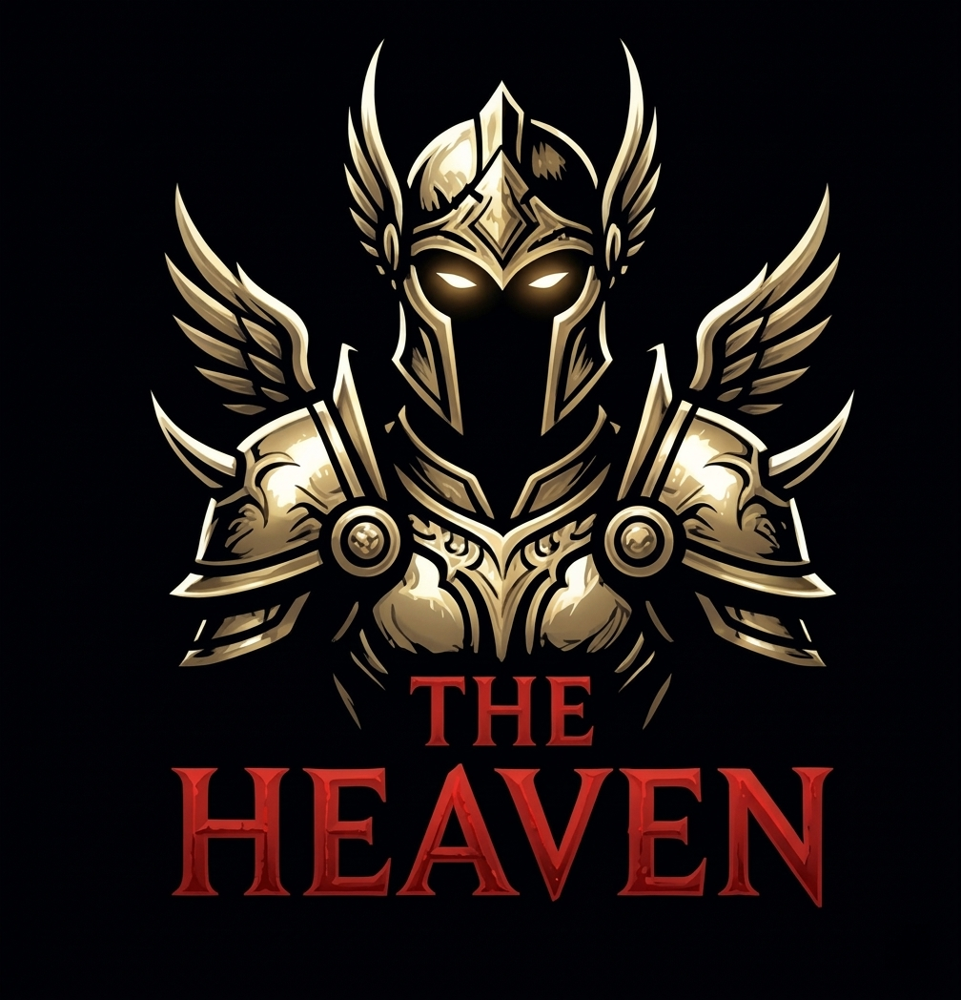

  

  The Hell 4 experience, but with less grind and more fun!

  ### [⬇️ Download Latest Release](https://github.com/roboserg/diablo-1-the-heaven/releases)

  

## About

A quality-of-life mod built on The Hell 4. Retains the challenge and depth of TH4 while cutting the tedious grind.

### Balance Adjustment Examples:
* **Game Speed Control**: Time speed button (1.0x → 1.25x → 1.5x) now available in all single-player game modes
* **Independent Rare Item Drops**: Rare items now have their own drop chance (2% for mobs, 3% for bosses) separate from unique items, matching Diablo 2's priority chain
* **Rare Item Affixes Buffed**: All rare item affix values are now higher (×1.25 for low/mid tier, ×1.5 for high tier)
* **Acceleration Game Changer**: Experience multiplier increased from 2x to 5x (single-player, Easy mode)
* **Swift Learner Perk**: XP gain per level increased from +5% to +20%
* **Black Mushroom Quest**: Spectral Elixir now grants +5 to all stats in non-Classic modes
* **Psion Aura**: Damage output ~50% higher due to improved scaling formula (reverted to The Hell 2 levels)
* **Grim Deal Trait**: Fixed undocumented spell damage penalty that was silently reducing all spell damage
* **Infernal Bargain Synergy**: Re-enabled for all classes. Trades life & mana regeneration and all stats for extra perk points

For complete release notes and version history, see [CHANGELOG](docs/CHANGELOG.md). For a full list of quests and objectives, see [QUESTS](docs/QUESTS.md).

> This mod should be compatible with later versions of The Hell 4 mod, until it's not. Save files created in The Hell 4 mod are **not compatible** with this mod. For The Hell 4 documentation, see [TH4_Changelog.txt](docs/legacy/TH4_Changelog.txt) and [TH4_Readme.txt](docs/legacy/TH4_Readme.txt).

## Installation

### Case 1: Fresh Installation (TH4 not installed)

1. **Set up your mod directory** — You only need `DIABDAT.MPQ` from Diablo 1
   - **Option A:** Use your existing Diablo 1 installation directory
   - **Option B:** Create a new "Diablo The Heaven" folder and copy `DIABDAT.MPQ` there

2. **Download [The Hell 4](https://www.moddb.com/mods/diablo-the-hell-4/downloads/th4)** from ModDB, extract it, and copy `TH4data.mor` to your chosen directory

3. **Download The Heaven mod** from [GitHub Releases](https://github.com/roboserg/diablo-1-the-heaven/releases) and extract all files to the same directory

4. **Run `TheHeaven.exe`** and enjoy!

### Case 2: Existing TH4 Installation

> **Important:** Make a backup copy of your TH4 folder before upgrading. Do not mix The Heaven saves with The Hell 4 saves — they are not compatible.

1. **Download The Heaven mod** from [GitHub Releases](https://github.com/roboserg/diablo-1-the-heaven/releases)

2. **Extract all files to your TH4 folder** (overwrite when prompted)

3. **Run `TheHeaven.exe`** and enjoy!

### Nightly Builds (Latest Features, May Have Bugs)

Want to try the newest features right away? Download the **`nightly`** build from [GitHub Releases](https://github.com/roboserg/diablo-1-the-heaven/releases). It's updated automatically with the latest changes, but may be unstable. For a safer experience, stick with regular versioned releases like `v0.0.4`.

## Planned changes

* Hotkey for quick save/load (where game mode allows)
* Remove negative penalties from unique items
* Sockets for magic and rare items
* Unsocket items
* Town portal in the center of town
* Chest in the center of town
* Re-roll affixes on magic and rare items
* Item sharing in multiplayer

## Build

Improved development experience vs. the original source:
* Updated build system for modern Windows environments using **VS Code** (Visual Studio no longer required)
* Cleaned up codebase (removed dev tools and legacy files)
* Easy one-command builds via `build.ps1`

See [BUILD.md](docs/BUILD.md) for detailed build instructions.

## Credits

Based on [the-hell-4-src](https://github.com/roboserg/the-hell-4-src), an upload of The Hell 4 source files that were publicly released by [The Hell team](https://www.patreon.com/thmod).